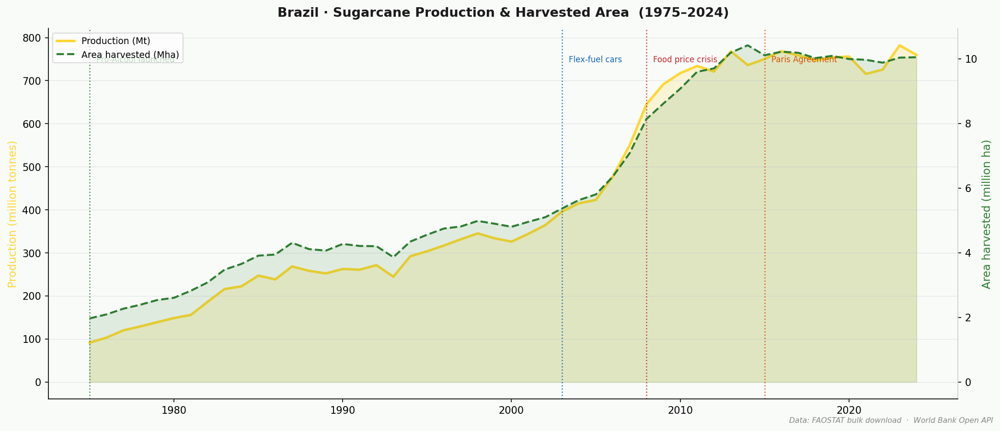
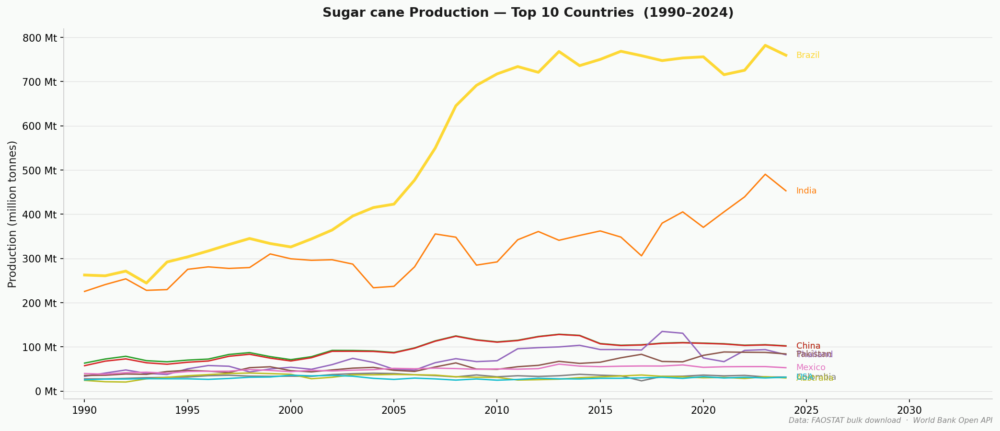
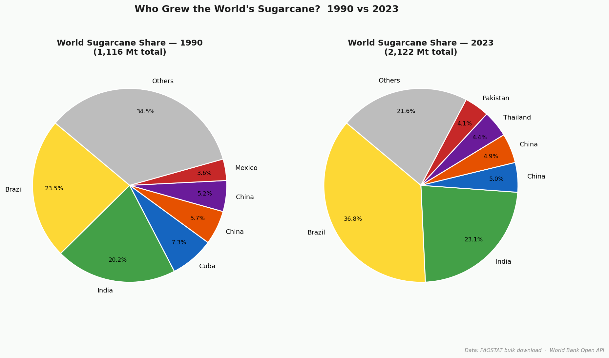
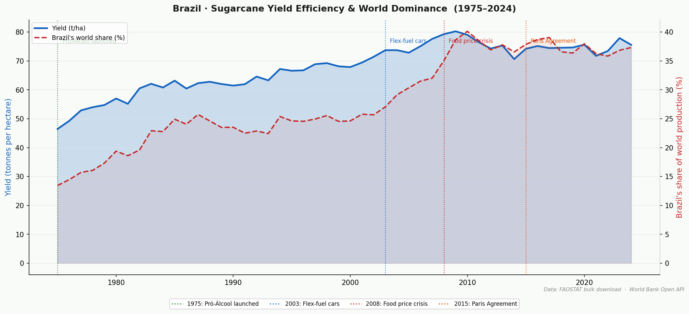
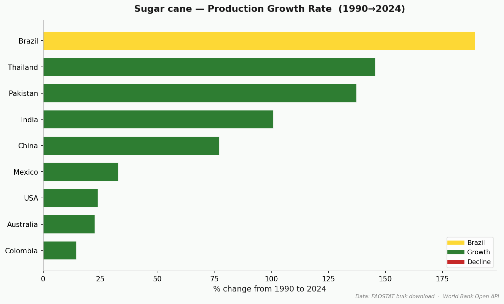
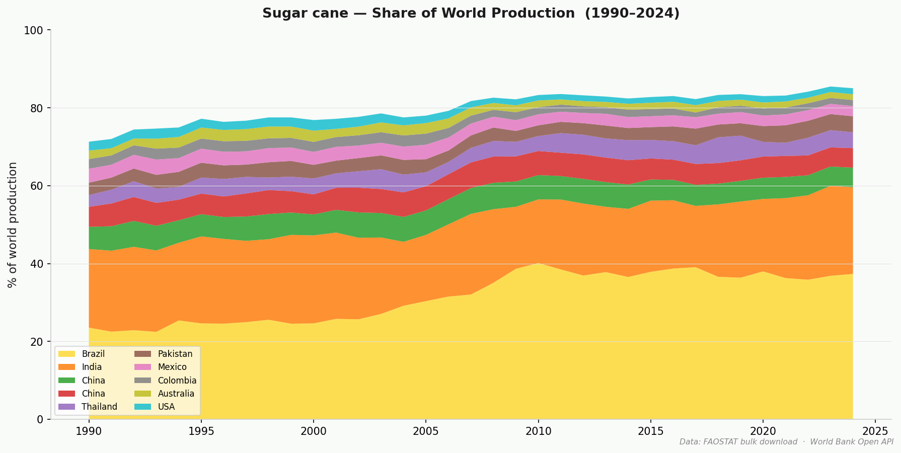

# Faostat Crop Explorer

> How did Brazil become the engine of the world's sugar supply?

---

## Brazil and the Sugarcane Century

Sugarcane arrived in Brazil in the 1500s, but the modern story begins in **1975**.

The global oil shock of 1973 left Brazil, then almost entirely dependent on imported oil, economically exposed. The government's response was **Pró-Álcool**, a national programme that bet the country's energy future on sugarcane ethanol. It was one of the largest energy policy experiments ever attempted.

The numbers tell what happened next:

| Year | Production | Area harvested | Yield | Brazil's world share |
|------|-----------|---------------|-------|----------------------|
| 1975 | 91.5 Mt   | 2.0 Mha       | 46.5 t/ha | 13.5% |
| 1990 | 262.7 Mt  | 4.3 Mha       | 61.5 t/ha | 23.5% |
| 2003 | 396.0 Mt  | 5.4 Mha       | 73.7 t/ha | 27.1% |
| 2010 | 717.5 Mt  | 9.1 Mha       | 79.0 t/ha | **40.1%** |
| 2020 | 756.1 Mt  | 10.0 Mha      | 75.6 t/ha | 38.0% |
| 2023 | 782.1 Mt  | 10.0 Mha      | 77.9 t/ha | 36.8% |

*Source: FAOSTAT. Mt = million tonnes. Mha = million hectares.*

In 1975, Brazil produced 13.5% of the world's sugarcane. By 2010, it produced more than 40%, nearly **8× more cane from the same land**, driven by yield gains from plant breeding, mechanisation, and precision agriculture.



The chart above shows the two curves that define Brazil's sugarcane story: production (yellow) and harvested area (green dashed). Notice how the flex-fuel inflection of 2003 accelerated both, and how production continued rising even as area growth levelled off, the signature of improving yield.

---

### The flex-fuel turning point (2003)

In 2003, Volkswagen launched the first mass-market flex-fuel car in Brazil, a vehicle that could run on any blend of petrol and ethanol. Within five years, more than 90% of new cars sold in Brazil were flex-fuel. Demand for ethanol surged and so did cane: production nearly doubled between 2003 and 2010.

Zoom out to the global picture and Brazil's trajectory is even more striking:



Every other major producer grew modestly. Brazil grew exponentially. The gap between Brazil and India, the second-largest producer, widened from roughly 30 Mt in 1990 to nearly 300 Mt by 2010.

---

### Where the world stands today

Brazil is not just the largest producer, it produces more sugarcane than the next two countries combined:

| Rank | Country | Production (2023) |
|------|---------|------------------|
| 1 | **Brazil** | **782 Mt** |
| 2 | India | 491 Mt |
| 3 | China | 105 Mt |
| 4 | Thailand | 94 Mt |

The runner-up, India, is a country of 1.4 billion people with a vast agricultural base. Brazil still produces 60% more cane.



In 1990, the world's sugarcane was broadly distributed, Brazil held 23.5%, India 20%, and Cuba was still a significant producer at 7.3%. By 2023, the picture had consolidated sharply: Brazil alone accounts for 36.8% of all cane grown on Earth, while Cuba has all but disappeared from the global chart.

---

### What the yield curve reveals

Perhaps the most remarkable number is yield. In 1975, Brazilian fields produced **46.5 tonnes per hectare**. By 2010, that had risen to **79 t/ha**, a 70% improvement without expanding the planted area proportionally. This is the fingerprint of the Brazilian agricultural research system (Embrapa) and decades of varietal improvement.



The blue line tracks yield per hectare; the red dashed line tracks Brazil's share of world production. The two curves rise together, higher yield unlocked the ethanol economics that drove area expansion, and area expansion funded further research. A reinforcing cycle that took Brazil from 13.5% of world production in 1975 to a sustained 35–40% today.

---

### How production grew across all top producers



Brazil's 200%+ growth over 34 years is the standout, but the chart also reveals how broadly sugarcane expanded: every top-10 producer grew. The crop's global footprint roughly doubled, from around 1.1 billion tonnes in 1990 to over 2.1 billion tonnes today.



The stacked area makes the structural shift visible: Brazil's yellow band grows steadily from the bottom while India's green band also expands, and the grey "rest of the world" band shrinks as production concentrates in fewer, more efficient producers.

---

## About this project

This repository exposes the full FAOSTAT crop production dataset (1961–2024, 301 crops, 144 countries) as a REST API and a storytelling visualisation script. No API keys required.

**Data sources**
- [FAOSTAT](https://www.fao.org/faostat) - production, area harvested, yield (bulk download, cached locally)
- [World Bank Open Data](https://data.worldbank.org/) - GDP and population for enrichment

**Subfolders**

| Folder | What's inside |
|--------|--------------|
| [`faostat/`](faostat/README.md) | Python library - download, cache, and query FAOSTAT data |
| [`api/`](api/README.md) | FastAPI REST API - 8 endpoints, auto-generated Swagger docs |
| [`scripts/`](scripts/README.md) | Storytelling visualisation script |
| `data/` | Local cache (`.gitkeep` only - populated on first run) |
| `outputs/` | Generated plots - regenerated by `scripts/storytelling.py` |

**Quick start**

```bash
pip install -r requirements.txt

# Run the API
uvicorn api.main:app --reload
# → http://localhost:8000/docs

# Run the visualisation
python3 scripts/storytelling.py
```
